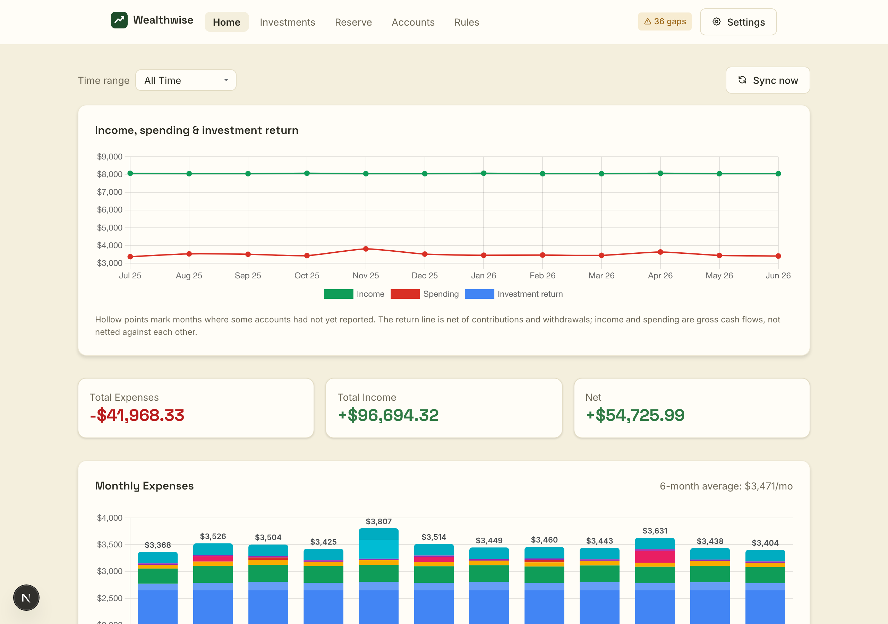
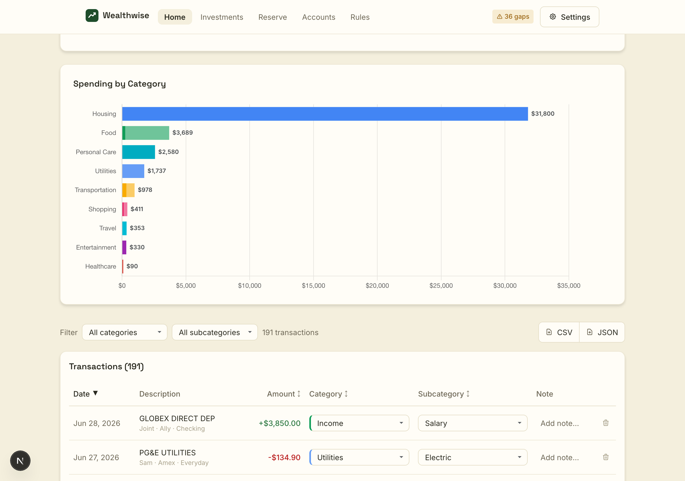
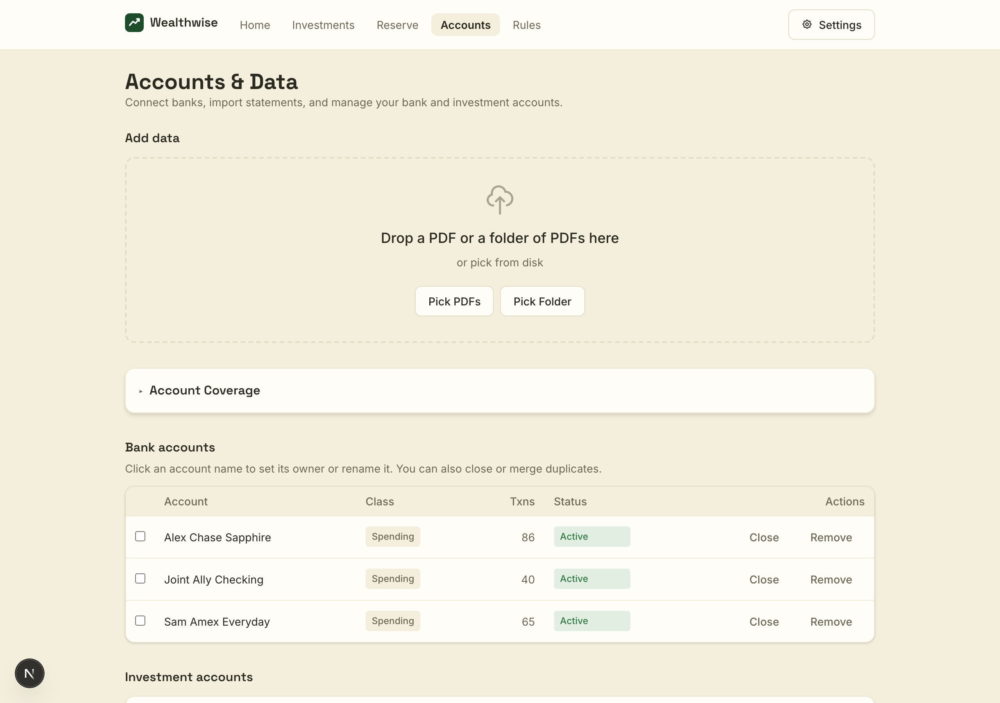
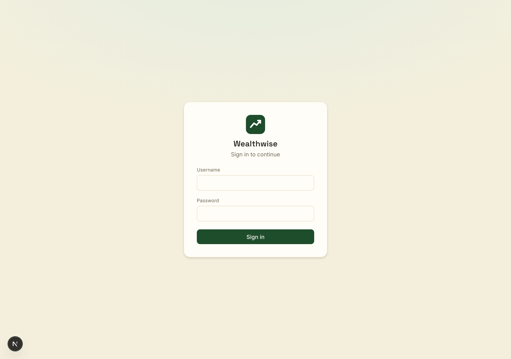

# Wealthwise

A self-hosted personal finance app to help you track and hopefully reduce your spending, build buffer for unexpected needs with emergency fund, and accumulate wealth through diversified investments. Import bank & brokerage statement PDFs and/or connect accounts via [Plaid](https://plaid.com); Claude classifies each transaction into a category/subcategory. Track spending, account coverage, and investment allocation over time. AI also assists to set rules to classify your expenses. **All data stays on your own machine** in a local SQLite file — nothing is sent to a third party except the transaction text you ask Claude to classify and (optionally) Plaid.

> Single-tenant and local-first: one household shares one database and one login — there are
> no separate per-user accounts. Locally it runs with no login by default; for any
> deployment reachable over the internet it ships a **built-in shared-login gate** that fails
> closed until you set a password (see [Sharing across devices](#sharing-across-devices)).

## Screenshots




| Transactions & categories                          | Accounts                                   | Sign in                                |
| -------------------------------------------------- | ------------------------------------------ | -------------------------------------- |
|  |  |  |

<sub>All screenshots use fake demo data.</sub>

## Stack

- Next.js 15 (App Router) + React 19 + TypeScript
- Tailwind CSS 4
- SQLite via `better-sqlite3` + Drizzle ORM
- `@anthropic-ai/sdk` (Claude) for transaction classification
- `plaid` + `react-plaid-link` for optional bank sync
- `pdfjs-dist` for client-side PDF text extraction
- Chart.js for visualizations

## Prerequisites

- **Node.js 20+** and npm
- An **Anthropic API key** for classification — the only thing you actually need. Get one at
  [https://console.anthropic.com/settings/keys](https://console.anthropic.com/settings/keys) (classifying a statement costs pennies), or
  paste it into the in-app **Settings** dialog at runtime instead of using a file.
- *(Optional)* Your own **Plaid account + credentials**, only if you want automatic bank
  sync. Everything works without it — see [API keys](#api-keys--bring-your-own).

> **Bring your own keys.** These are personal credentials tied to your own accounts and
> billing — use your own, never someone else's. Sharing Plaid production secrets in
> particular means other people's bank connections would land under (and be billed to) your
> Plaid account.

## Quick start

```bash
git clone <your-fork-url> expense-tracker
cd expense-tracker/app
npm install
cp .env.example .env.local     # then edit .env.local (see Configuration)
npm run db:migrate             # create the SQLite database
npm run dev                    # http://localhost:3000
```

That's enough to import statement PDFs. To classify transactions, provide an Anthropic key
either in `.env.local` (`ANTHROPIC_API_KEY=`) or via **Settings** in the top-right of the
UI (stored in your browser's `localStorage`, sent per-request). The UI key wins when both
are set.

## API keys — bring your own

**Anthropic (required, easy).** Sign up at the [Anthropic Console](https://console.anthropic.com),
create a key, and either set `ANTHROPIC_API_KEY` in `.env.local` or paste it into the app's
Settings. Pay-as-you-go; classifying a statement is a few cents.

**Plaid (optional, more involved).** Bank sync needs your own Plaid account, and the two
environments differ a lot in effort:


|         | Sandbox                          | Production                                                                   |
| ------- | -------------------------------- | ---------------------------------------------------------------------------- |
| Access  | **Free, instant** — no approval | Requires a Plaid**production access request** (a review), and can carry cost |
| Banks   | Fake test institutions           | Your real banks                                                              |
| Use for | Trying auto-sync, development    | Actual daily use                                                             |

**Getting Plaid credentials:**

1. Create a free account at the [Plaid Dashboard](https://dashboard.plaid.com/signup).
2. Copy your **client_id** and **Sandbox secret** from **Developers → Keys**, and set
   `PLAID_CLIENT_ID`, `PLAID_SECRET_SANDBOX`, and `PLAID_ENV=sandbox`. In Plaid Link's
   sandbox you sign in to a test bank with `user_good` / `pass_good`.
3. For real banks, request **Production** access from the dashboard (Plaid reviews it), then
   set `PLAID_SECRET_PRODUCTION` and `PLAID_ENV=production`. Plaid's
   [Quickstart](https://plaid.com/docs/quickstart/) walks through the whole flow.

For most people the **PDF-import path (Anthropic key only) is the simplest way to run the
app** — Plaid is an optional power-up. Getting Plaid *production* access approved for
personal use is the one real hurdle, so don't let it block you: start with PDFs. And again,
each person needs their **own** Plaid credentials — you can't reuse someone else's.

## Configuration

All configuration is via `app/.env.local` (copy from `.env.example`). Everything except the
Anthropic key is optional.


| Variable                                           | Purpose                                                                                                                                                        |
| -------------------------------------------------- | -------------------------------------------------------------------------------------------------------------------------------------------------------------- |
| `ANTHROPIC_API_KEY`                                | Server-side key for classification. Optional if you paste one in the UI.                                                                                       |
| `DATABASE_URL`                                     | SQLite file location. Defaults to`file:./data/app.db`.                                                                                                         |
| `NEXT_PUBLIC_ACCOUNT_OWNERS`                       | Comma-separated names for the account-owner dropdowns, e.g.`Alex,Sam`. A "Joint" option is always added. Defaults to `Person 1,Person 2`.                      |
| `PLAID_CLIENT_ID`                                  | Plaid client id (only for bank sync).                                                                                                                          |
| `PLAID_ENV`                                        | `sandbox` (default) or `production`.                                                                                                                           |
| `PLAID_SECRET_SANDBOX` / `PLAID_SECRET_PRODUCTION` | Per-environment Plaid secret (`PLAID_SECRET` is a single-secret fallback).                                                                                     |
| `PLAID_COUNTRY_CODES`                              | Defaults to`US`.                                                                                                                                               |
| `APP_ENCRYPTION_KEY`                               | **Required if Plaid is used.** Base64 32-byte key that encrypts stored Plaid access tokens. Generate with the command below.                                   |
| `AUTH_USERNAME` / `AUTH_PASSWORD`                  | Shared login gate. Setting`AUTH_PASSWORD` turns it on; in a production build it **fails closed** (refuses to serve) until you do. `AUTH_USERNAME` is optional. |
| `AUTH_SECRET`                                      | Signs the session cookie; falls back to`AUTH_PASSWORD` if unset.                                                                                               |

Generate an encryption key:

```bash
node -e "console.log(require('crypto').randomBytes(32).toString('base64'))"
```

If no Plaid variables are set, the app runs in **PDF-only** mode.

## Usage

1. Upload a bank-statement PDF via the drop zone (text is extracted in your browser).
2. Claude extracts and classifies each transaction; review and adjust categories inline.
3. **Save All** — saved transactions live in the SQLite DB. Re-categorizing a merchant is
   learned and biases future classifications.
4. Filter by date range; view monthly/category charts and investment allocation.
5. *(Optional)* Connect a bank via Plaid to sync recent transactions automatically. Note
   Plaid only returns roughly the last 90 days — older history must come from statement PDFs.

Duplicate detection runs on save (same `date|description|amount|bank|account` is skipped),
plus a cross-source pass that reconciles the same charge arriving from both a statement and
Plaid.

## Where your data lives

Everything is under `app/data/` (gitignored except `taxonomy.json`):


| File            | Purpose                                                                         |
| --------------- | ------------------------------------------------------------------------------- |
| `app.db`        | The live SQLite database — all accounts, transactions, and connections         |
| `taxonomy.json` | Category/subcategory definitions used by the classifier and UI (tracked in git) |

Back it up by copying `app.db`. To move your data to another machine, copy `app.db`
directly — **and if you use Plaid, copy the same `APP_ENCRYPTION_KEY`**, or the stored bank
tokens won't decrypt.

## Sharing across devices

Because the DB is a single file, two people who want to share the same data should run
**one** instance both can reach — copying the file to a second laptop just creates two
databases that diverge. Turn on the built-in login gate (set `AUTH_PASSWORD`) before
exposing it anywhere. Practical options:

- **One always-on machine** (home server, spare laptop, small VM) running
  `npm run build && npm start`, reachable from your devices over a private network like
  [Tailscale](https://tailscale.com).
- **A managed host.** [Fly.io](https://fly.io) is a good fit — this repo ships a `Dockerfile`
  and `fly.toml`, and **[DEPLOY.md](app/DEPLOY.md)** is a full walkthrough: a persistent volume
  for the SQLite file, the login gate, moving an existing database up, and optional GitHub
  Actions auto-deploy. Any host with a **persistent disk** works; serverless platforms with
  ephemeral filesystems don't, unless you move off file-based SQLite.

## Production build

```bash
npm run build
npm start            # serves the production build on :3000
```

## Troubleshooting

- **Port 3000 in use:** `lsof -ti:3000 | xargs kill -9`
- **"No Anthropic API key configured":** open Settings and paste a key, or set
  `ANTHROPIC_API_KEY` in `.env.local`.
- **"Could not extract text from PDF":** the PDF is scanned/image-based. Run it through OCR
  first.
- **Plaid connection fails to save:** ensure `APP_ENCRYPTION_KEY` is set to a valid base64
  32-byte value.

## Feedback & contributing

- **Bugs & feature requests** → open a [GitHub issue](../../issues/new/choose) (there are templates).
- **Questions & ideas** → use [Discussions](../../discussions).
- **Security issues** → please report privately — see [SECURITY.md](SECURITY.md), not a public issue.

See [CONTRIBUTING.md](CONTRIBUTING.md) for dev setup and PR guidelines. This is a small
self-hosted project maintained in spare time — friendly feedback is very welcome.

## License

[MIT](LICENSE).
